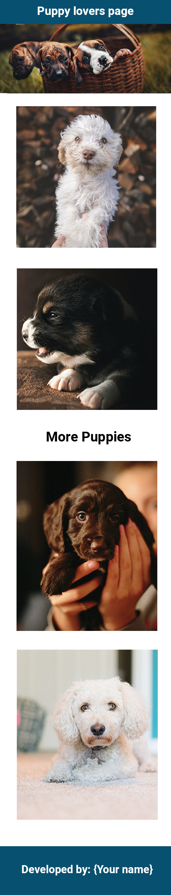

# Web Development Practice Projects

Welcome to my web development journey repository. Here, you'll find a collection of web apps I've created to practice and enhance my skills in HTML, CSS, JavaScript, and various web technologies. Each app is housed in its dedicated folder, complete with the source code.

## Technologies and Tools

Throughout this project, I've utilized the following technologies and tools:

- HTML
- CSS
- JavaScript
- Bootstrap
- jQuery
- Font Awesome
- Google Fonts
- And more!

## Apple Home Page Replica

  

    
    
Desktop Version

  

  

    
    
Mobile Version

  

This project is a faithful replica of the Apple home page, built with HTML and CSS. It served as an excellent platform for practicing fundamental CSS layout techniques, including containers, units (such as px, em, rem, %), positioning, flexbox, grid, and more.

**Live Demo**: (Provide the link when hosted)

## Puppy Lovers Page

This web page is designed for all the puppy lovers out there. The design was provided by the Evangadi Tech instructors during my full-stack (MERN stack) course. The main goal of this project was to understand and implement responsive web design using the `@media` tag in CSS.

  

    
    
Desktop Version

  

  

    
    
Mobile Version

  

**Live Demo**: (Provide the link when hosted)
